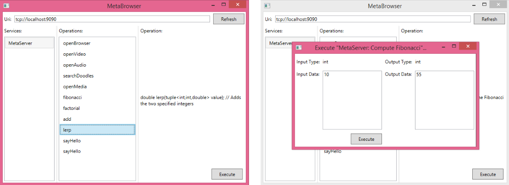
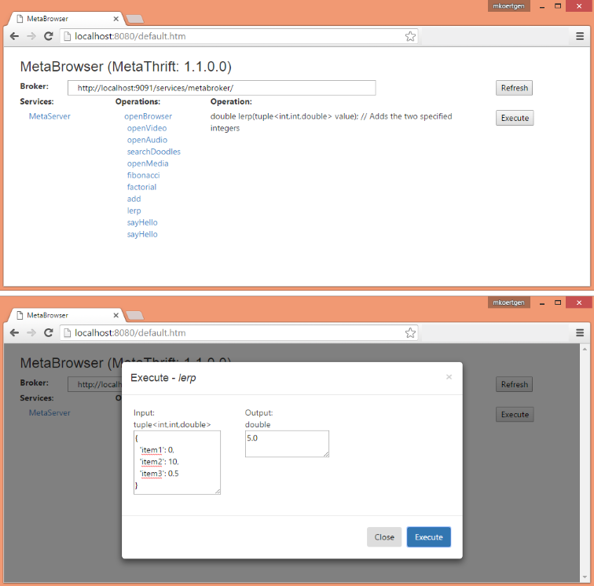

# MetaThrift

Development is slowed down when changing contract [IDLs](https://thrift.apache.org/docs/idl) is discouraged, e.g. because the code generation maybe a fragile, non-automated process. An intermediate solution is to decouple the contract interfaces (API) from the transport protocol so changing the API becomes independent from changing the IDL. We did just that by introducing a meta IDL that supports a generic call pattern. The basic idea is that 

1. operations are called by name and
2. arguments and results are transparently serialized in a generic fashion.

How does that look like? Here is a client example in **Java** which calls the `fibonacci`-operation with the argument `5`

	MetaService.Client service = ...
	Integer result = call(service, "fibonacci", 5, Integer.class, Integer.class);

The same example in **.NET**:

	MetaService.Iface service = ...
	var result = service.Call<int, int>("fibonacci", 5);

The implementation is based on [Apache Thrift](https://thrift.apache.org/). Here is the idl [MetaThrift.thrift](MetaThrift.thrift).

### Disclaimer

The approach presented with **MetaThrift** is for the desperate individuals out there that cannot make a direct switch to the web (e.g. REST). It may alleviate an incremental change process or at least help to start it. 

One step ahead would be to make the switch to REST in your desktop applications before finally switching to web applications. 

An example for web enabled desktop applications is e.g. [mkoertgen/hello.webapi.wpf](https://github.com/mkoertgen/hello.webapi.wpf).

## Supported Features

- Actions (no return) and Functions with generic argument and return types including `void` parameters (no parameter)
- Generic serialization via [JSON](http://de.wikipedia.org/wiki/JavaScript_Object_Notation)
- Well-known types like `void, integral types, string, floats, decimal, date/time`
- Custom types by namespace qualified name; overridable with explicit type registration
- Generic collections like `array<T>, list<T>, map<TKey,TValue>` 
- Tuples for up to four items like `tuple<T1,T2,T3,T4>`
- Supports **.NET**, **Java** and **TypeScript** (client only)

## MetaBroker

Instead of peer-to-peer `MetaService` connections that have to be managed by the client, we recommend using the `MetaBroker`. The `MetaBroker` is itself a `MetaService` which acts as a message bus dispatching calls and results between applications. 

So when a client wants to take advantage of yet another service it does not need to handle that extra peer. Instead, the service registers itself to the `MetaBroker` and it becomes instantly available to all clients.

The `MetaBroker` supports a) registration of services and b) dispatching calls and results from and to the clients.
It also mediates between multiple protocols, e.g. **TCP** (default port 9090) and **HTTP** (default port 9091). This way, a service that only supports TCP can **easily be exposed to web applications over HTTP**.

Here is a client example in **TypeScript** taken from the `MetaBrowser` application:

	this.brokerUri = ko.observable("http://localhost:9091/services/metabroker/");
    this.broker = new MetaBrokerClient(MetaThrift.createProtocol(this.brokerUri()));

    var operation : MetaOperation = this.selectedOperation().operation;

	var input = new MetaObject();
	input.typeName = operation.inputTypeName;
	input.data = this.inputData();

	var output = this.broker.call(operation, input);

	this.outputData(output.data);

The `MetaBroker` service is implemented in .NET and Java.

## MetaBrowser 

The `MetaBrowser` is a generic client application for the `MetaBroker` that allows browsing the registered services and executing their operations. The `MetaBrowser` application is implemented in .NET (WPF) and TypeScript ([Knockout](http://knockoutjs.com/)).

Below you find some screenshots of the `MetaBrowser` application browsing and executing the operations from the test `MetaServer` which registered itself to the `MetaBroker`.

**Note:** The test `MetaServer` supports only **TCP** whereas the `MetaBroker` can expose the service operations also over **HTTP** (including [CORS](https://en.wikipedia.org/wiki/Cross-origin_resource_sharing)) which makes it possible that **a web application can talk to a local application!**

### Screenshots of the .MetaBrowser .NET/WPF application

### Screenshots of the .MetaBrowser Web app (TypeScript)

## Implementing a server

To implement a server subclass the `AbstractMetaService` or use the `DynamicMetaService` and register some operations. Here is an example copied from the unit tests:

### .NET

    var service = new DynamicMetaService("MyName", "MyDisplayName", "MyDescription");

    service.RegisterAction<string>("openBrowser", uri => Process.Start(uri), "Open Browser", "Opens a web browser with the specified uri");

	service.RegisterAction("searchDoodles", () => Process.Start("http://www.google.com/doodles/"), "Search Doodles", "Opens the Google Doodle page");

    service.RegisterFunc<Tuple<int, int>, int>("add", t => t.Item1+t.Item2, "Add", "Adds two integers");

### Java

    final DynamicMetaService service = new DynamicMetaService("MyName",
		"MyDisplayName", "MyDescription");

	service.registerAction("openBrowser", String.class,
		new Action<String>() {
			public void call(String input) throws IOException { 
				launchApp(input); 
			}
		},
		"Open Browser", "Opens a web browser with the specified url");

	service.registerAction("searchDoodles", 
		new VoidAction() {
			public void call() throws Exception { 
				launchApp("http://www.google.com/doodles/"); 
			}
		}, 
		"Search Doodles", "Opens the Google Doodle page");

	service.registerFunc("fibonacci", Integer.class, Integer.class,
		new Function<Integer, Integer>() {
			public Integer call(Integer input) throws Exception { 
				return 	fibonacci(input); 
			}
		}, 
		"Fibonacci", "Computes the Fibonacci series for the specified number");
